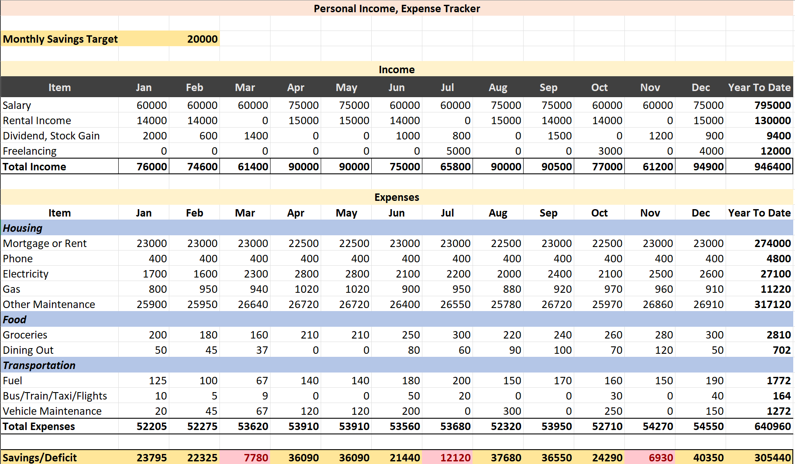

# Personal Income & Expense Tracker  

  
  
  
  

---

📌 **Overview**  
This project is an Excel-based **Personal Income & Expense Tracker** designed to help individuals monitor their monthly income, expenses, and savings. It provides a structured way to manage finances, track spending habits, and compare progress against a savings goal.

---

## 📊 Features  

- **Monthly Income Tracking**  
  - Salary  
  - Rental Income  
  - Dividend/Stock Gains  
  - Freelancing  

- **Expense Categories**  
  - **Housing:** Rent/Mortgage, Phone, Electricity, Gas, Other Maintenance  
  - **Food:** Groceries, Dining Out  
  - **Transportation:** Fuel, Bus/Train/Taxi/Flights, Vehicle Maintenance  

- **Savings Calculation**  
  - Automatic calculation of monthly **Savings/Deficit**  
  - Year-To-Date (YTD) tracking for Income, Expenses, and Savings  

- **Customizable Monthly Savings Target**  
  - Set and track your savings goal (default: `20,000`)  

---

## 📈 Insights  

- View **total income and expenses** month by month.  
- Instantly see whether you achieved your monthly savings goal.  
- Identify overspending areas (highlighted deficits in red).  
- Track financial growth with **Year-To-Date totals**.  

---

## 🛠️ How to Use  

1. Open the Excel file.  
2. Enter your **income** and **expense data** for each month.  
3. The sheet will automatically:  
   - Calculate totals  
   - Track savings vs. target  
   - Highlight months where you fall short  

---

## 📷 Example (Tracker Screenshot)  

  

## 💡 Use Cases  

- Personal finance management  
- Household budgeting  
- Freelancers tracking multiple income sources  
